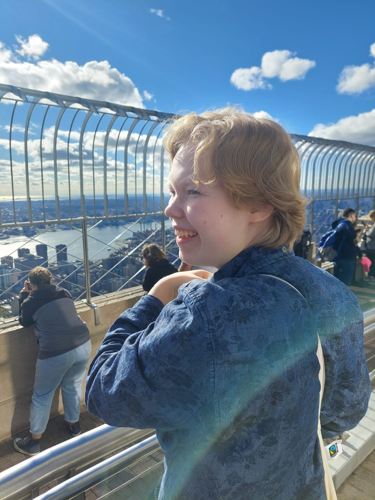

## Introduction

 I'm a second year undergraduate student at the University of Helsinki. My major is in linguistics and I'm also studying language technology. I love languages and I'm currently also studying Portuguese. In my free time I play the percussion at the Helsinki University Symphony Orchestra.

## Find me on

[My CV](https://www.overleaf.com/read/pmvptvsbbmgg), [GitHub](https://github.com/shilosuo)

## Contact

My email address is silva.hilosuo@helsinki.fi. 

## Courses I've Taken

[Command Line Tools for Linguists (5 cr)](https://studies.helsinki.fi/courses/cu/hy-CU-134651633-2021-08-01/KIK-LG221/Command_Line_Tools_for_Linguists), fall 2022

[Semantics and Pragmatics (10 cr)](https://studies.helsinki.fi/courses/cu/hy-CU-117877915-2021-08-01/KIK-LG103/Semantics_and_Pragmatics), spring 2022

[Morphology and Syntax (10 cr)](https://studies.helsinki.fi/courses/cu/hy-CU-117877884-2021-08-01/KIK-LG102/Morphology_and_Syntax), spring 2022

[Phonetics and Phonology (10 cr)](https://studies.helsinki.fi/courses/cu/hy-CU-117877928-2021-08-01/KIK-LG101/Phonetics_and_Phonology), fall 2021

[Introduction to Language Technology (5 cr)](https://studies.helsinki.fi/courses/cu/hy-CU-118591924-2021-08-01/KIK-405/Introduction_to_Language_Technology), fall 2021

## Projects

* [My GitHub project](https://github.com/shilosuo/cmdline-course)

 This is my Git repository for the command line course

## Misc. 

[Helsinki University Symphony Orchestra](https://ys.fi/briefly-in-english/) 